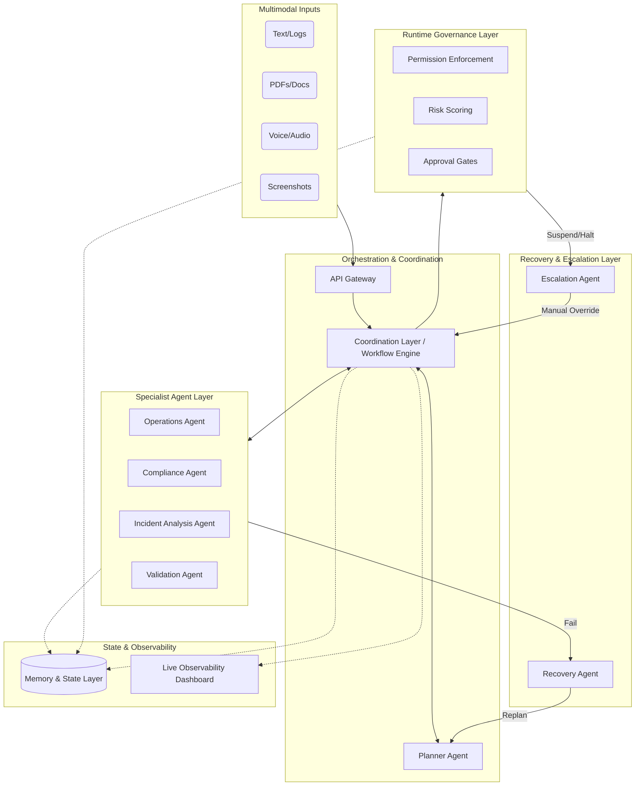

<div align="center">
  
  # AEOS Control Panel
  
  **Autonomous Enterprise Operations System**
  
  *From AI copilots to autonomous operational systems.*
  
  <br />

  
  
  
  
  
  
  
  
  

</div>

---

# **Overview**

AEOS Control Panel is a web-based autonomous enterprise operations platform that enables organizations to safely deploy AI agents capable of planning, coordinating, executing, and adapting complex workflows in real time.

Unlike traditional AI assistants that only respond to prompts, AEOS functions as a persistent operational control plane where specialized AI agents collaborate to manage enterprise workflows across incident response, support escalation, operational coordination, compliance validation, and enterprise execution.

The platform combines:

- autonomous reasoning
- multi-agent orchestration
- multimodal intelligence
- runtime governance
- adaptive recovery
- live observability

into a production-style enterprise system designed for the future of autonomous work.

---

# **The Problem**

Modern enterprises are rapidly adopting AI agents, but current systems remain fundamentally unreliable for operational deployment.

Today’s AI copilots:

- lack accountability
- cannot safely execute autonomous workflows
- fail unpredictably under complex multi-step tasks
- have limited observability
- cannot dynamically recover from failures
- operate without runtime governance
- struggle with long-running enterprise coordination

As organizations move from assistive AI toward autonomous execution, enterprises require a new operational layer capable of governing, coordinating, and monitoring AI systems at runtime.

---

# **Solution**

AEOS introduces a runtime-governed enterprise orchestration mesh where specialized AI agents continuously coordinate and execute workflows under a centralized operational authority.

The system acts as an autonomous enterprise operations layer capable of:

- decomposing enterprise objectives
- dynamically planning workflows
- coordinating specialist agents
- analyzing multimodal operational inputs
- validating execution safety
- handling failures autonomously
- escalating uncertainty to humans
- maintaining complete auditability

AEOS transforms AI agents from isolated assistants into coordinated operational systems.

---

# **Core Use Case**

## **Autonomous Enterprise Incident & Operations Coordination**

AEOS autonomously manages enterprise operational incidents using multi-agent coordination.

### **Example Operational Flow**

#### **Inputs**

The platform continuously ingests:

- support tickets
- operational alerts
- screenshots
- dashboards
- PDFs
- logs
- emails
- voice escalation calls
- meeting transcripts

#### **Workflow**

The system:

1. Detects and classifies incidents
2. Determines operational severity
3. Spawns specialist agents
4. Investigates root causes
5. Queries relevant systems and APIs
6. Coordinates remediation workflows
7. Validates execution safety
8. Replans dynamically if execution fails
9. Escalates uncertain or high-risk actions
10. Maintains live audit trails and execution timelines

#### **Output**

The enterprise receives:

- autonomous incident resolution
- reduced operational latency
- execution transparency
- governed autonomy
- continuous operational monitoring

---

# **Key Features**

## **Autonomous Reasoning Engine**

AEOS dynamically adapts execution plans in real time.

Agents:

- reason about failures
- modify execution paths
- retry actions intelligently
- reroute workflows
- escalate uncertainty autonomously

This moves beyond static automation into true adaptive operational intelligence.

---

## **Multi-Agent Coordination System**

The platform operates as a collaborative AI workforce.

Specialized agents include:

- Planner Agent
- Incident Analysis Agent
- Operations Agent
- Compliance Agent
- Validation Agent
- Recovery Agent
- Escalation Agent
- Memory Agent

Agents coordinate through a shared runtime orchestration layer to solve tasks that a single LLM cannot reliably manage alone.

---

## **Runtime Governance Layer**

Inspired by enterprise runtime authority systems, AEOS governs autonomous execution in real time.

The governance layer provides:

- execution validation
- permission enforcement
- risk scoring
- action approval gates
- runtime policy enforcement
- anomaly detection
- audit logging
- circuit breakers for unsafe actions

This enables enterprises to safely operationalize autonomous AI workflows.

---

## **Agentic Workflow Engine**

AEOS autonomously:

- plans workflows
- invokes tools and APIs
- queries databases
- manages execution state
- coordinates long-running tasks
- tracks dependencies
- recovers from workflow failures

The platform continuously manages enterprise workflows without requiring manual step-by-step prompting.

---

## **Multimodal Intelligence**

The platform processes operational data across multiple modalities:

- text
- documents
- screenshots
- PDFs
- logs
- audio
- meeting transcripts

This allows richer contextual reasoning for enterprise decision-making.

Examples:

- analyzing escalation calls
- interpreting operational dashboards
- extracting insights from PDFs
- correlating screenshots with incidents

---

## **Live Observability & Auditability**

AEOS provides full operational visibility through:

- execution traces
- workflow graphs
- agent coordination maps
- runtime state inspection
- approval timelines
- audit streams
- recovery events

Every autonomous action is observable, attributable, and replayable.

---

## **Enterprise Reliability (Cisco Standard)**

AEOS is hardened for enterprise production deployments with foundational resilience mechanisms:

- **Centralized HTTP Client:** A unified `asyncio` client with dynamic Circuit Breakers preventing cascading ThreadPool exhaustion.
- **Retry Budgets & Exponential Backoff:** Native handling of transient network blips across all 13 microservices.
- **Edge Idempotency Keys:** Redis-backed idempotency caching at the API Gateway to safely handle client retries without duplicating workflows.
- **Database Read Replicas:** Separated connection pools for high-throughput reads (e.g., policy queries) vs. mutations via `asyncpg`.

---

# **System Architecture**



---

# **Technology Stack**

## **Frontend**

- Next.js
- TailwindCSS
- Real-time operational dashboard

## **Backend**

- FastAPI / Node.js orchestration services
- Async workflow engine
- WebSocket runtime streaming

## **Infrastructure**

- Vultr VM deployment
- Dockerized services
- Redis
- PostgreSQL / Supabase

## **AI & Reasoning**

- Gemini Pro for planning and reasoning
- Gemini Flash for low-latency workflows
- Featherless open-source specialist models

## **Voice & Audio**

- Speechmatics real-time transcription

---

# **Setup and Run Instructions**

## **1. Prerequisites**
- **Docker** and **Docker Compose** installed.
- **Node.js** (v18+) and **npm** installed.
- **Python** (v3.10+) installed.

## **2. Environment Variables**
Clone the repository and configure your environment variables:
```bash
cp .env.example .env
```
Ensure that you populate `.env` with your relevant API keys (`GEMINI_API_KEY`, `FEATHERLESS_API_KEY`, `JWT_SECRET`, etc.).

## **3. Launch the Architecture**
AEOS relies on 13 interconnected microservices, an Nginx reverse proxy, PostgreSQL, and Redis. Spin up the entire architecture using Docker Compose:

```bash
docker compose up -d --build
```
*Note: The Nginx proxy will automatically bind to port 80 and handle all routing between the frontend, API gateway, and websocket observability service.*

## **4. Access the Dashboard**
Once the containers are healthy, open your browser and navigate to:
`http://localhost`

## **5. Running the Test Ingestion Suite**
To verify that the multi-agent orchestration is working, you can push the provided test payloads into the system:

```bash
cd test_payloads
python3 run_payloads.py
```
This will automatically inject multimodal files (logs, text, JSON, screenshots, and audio) into the pipeline. You can watch the `Incident Analysis Agent` and `Planner Agent` process these workflows live in your Next.js dashboard!

### Testing Full 9-Agent Orchestration
We provide a comprehensive JSON test payload that orchestrates all specialist agents. Run it with:
```bash
python3 run_orchestration_test.py
```
This script injects a complex simulated incident requiring DB failover, compliance checks, and manual operator approval, demonstrating the interaction of the Planner, Governance, Operations, Compliance, Escalation, and Recovery agents.

### Note on DAG Visualizer
If you ingest an ambiguous file (e.g., `system_summary.pdf` or `glitch.txt`) where the `Incident Analysis Agent` cannot extract a clear error signature, it will return a low confidence score (< 0.70). 
When this happens, AEOS **immediately escalates** the incident to the `Escalation Agent` for human review, bypassing the `Planner Agent`. Consequently, the DAG Visualizer will correctly remain empty for these incidents until a human provides clarification. To see the DAG Visualizer populate, select incidents with clear errors (like `app_crash.log` or `orchestration_comprehensive.json`).

---


# **Why AEOS Is Different**

Most AI systems today are copilots.

AEOS is an operational runtime system.

Instead of simply answering questions, the platform:

- coordinates execution
- governs autonomy
- adapts workflows
- manages operational state
- monitors runtime behavior
- orchestrates specialized AI workers

The result is a deployable enterprise platform for autonomous operations.

---

# **Vision**

AEOS represents a shift from:

- isolated AI assistants  
    to
- governed autonomous enterprise systems.

The platform introduces a new operational model where AI agents function as coordinated digital operators capable of safely executing real enterprise workflows under continuous runtime governance and observability.